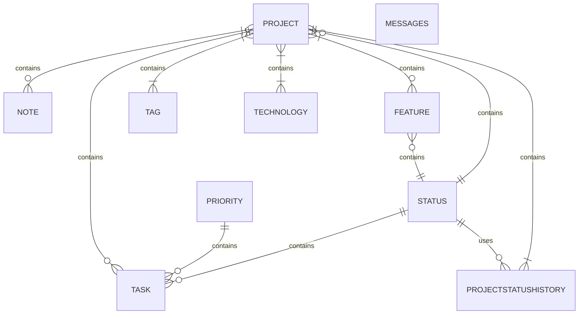

# Haepapa Portfolio Website

## Getting Started - Local Development

1. Clone the [hanga](https://github.com/Haepapa/hanga) repository and switch to the dev `branch`
2. With docker running run command `sudo make up` to initiate the containers
3. From Appwrite (`https://appwrite.localhost`) create a login, create an organisation `Haepapa` and create a new web project called `haepapacom`.
4. Run the below to create the `.env` file template
```bash
echo 'export VITE_AW_URL_ENDPOINT=https://appwrite.localhost/v1' | tee -a .env
echo 'export VITE_AW_PROJECT_ID=' | tee -a .env
echo 'export VITE_AW_DATABASE_ID=' | tee -a .env
echo 'export VITE_AW_COLLECTION01_ID=' | tee -a .env
echo 'export VITE_AW_COLLECTION02_ID=' | tee -a .env
echo 'export VITE_AW_COLLECTION03_ID=' | tee -a .env
echo 'export VITE_AW_BUCKET01_ID=' | tee -a .env
echo 'export VITE_AW_BUCKET02_ID=' | tee -a .env
```
5. Populate the `.env` file use the below guidance. Only populate the below varaibles.
- VITE_AW_PROJECT_ID: ID of the `haepapacom` project


## Appres

If running from `wsl` you may need to add the below to your `hosts` file.
```bash
echo "127.0.0.1 appwrite.localhost" | sudo tee -a /etc/hosts
```

### Data Model
ERD defined in `/appres` directory and built in Appwrite.
